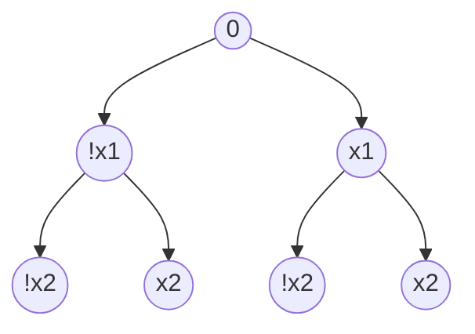

# Questão 1

PSPACE-Completude:
- Provar que existe algoritmo que resolve o problema de forma polinomial em espaço numa máquina não determinística. Isso prova que o problema pertence à PSPACE
- Reduzir um problema PSPACE-Difícil/Completo ao problema alvo, o que prova que o problema é PSPACE-Difícil
Se as duas condições forem cumpridas, temos que o problema pertence à PSPACE e PSPACE-Difícil, logo ele é PSPACE-Completo

### Algoritmo Polinomial em Espaço numa máquina (Não-Determinística? )

O algoritmo consiste em navegar recursivamente pela árvore na forma pós-ordem, determinando o valor de um nó baseado em quem realiza a jogada daquele nível.

Se o nó é uma folha, retorna 1 se é "tesouro" e 0 se é "gênio"
Se o nó representa uma jogada do jogador, retorna 1 se pelo menos um dos filhos é 1.
Se o nó é uma jogada do Gênio, retorna 1 se ambos os filhos possuem valor 1.

A navegação se dá empilhando os retornos de cada nó em uma pilha, e cada nó interno executa com os 2 valores no topo da pilha, que são o retorno de seus filhos, e depois os desaloca.

O tamanho máximo da pilha corresponde ao momento em que uma folha é acessada, pois o retorno da execução de seu pai realiza a desalocação de memória dos filhos.

A árvore de $4^n$ folhas possui profundidade $\log _2 4^n = \log _2 2^{2n} = 2n$. Então o tamanho máximo da pilha de execução do algoritmo é $O(2n)$.

Logo algoritmo é polinomial em memória.
### Redução partindo de QSAT

Parece um problema de  $\exists a \forall b \exists a \forall b$ que gera um caminhamento em árvore, preciso rever como provar a complexidade de problemas desse tipo.

https://en.wikipedia.org/wiki/True_quantified_Boolean_formula

### Função Redutora

Tomando QSAT na forma prenex CNF -> 
$\exists x_1 \forall x_2 \exists x_3 \forall x_4((x_1 \lor x_2) \land (x_3 \lor \neg x_4))$

Realizo dupla negação (contrapositiva), se torna a negativa de uma DNF ->
$\neg (\forall x_1 \exists x_2 \forall x_3 \exists x_4((\neg x_1 \land \neg x_2) \lor (\neg x_3 \land x_4)))$

A expressão mais interna da expressão contrapositiva é uma representação implícita de uma árvore, cada cláusula representa um caminho para um conjunto de folhas, tomando $\neg x_i$ como o filho à esquerda e $x_i$ como o filho à direita na profundidade $i$, todas essas folhas representadas por cláusulas são marcadas pelo valor 1.

A expressão interna (não-negada) é verdadeira se existe uma estratégia do gênio sempre vencer, ou seja, as folhas de valor 1 são as folhas "gênio".

A expressão completa então representa a possibilidade do jogador possuir uma estratégia vencedora, já que é verdadeira quando a interna, que representa a estratégia do gênio, é falsa.


### Se Gênio -> QSAT

Como mostrado anteriormente, a árvore de decisões do jogador é representada exatamente pela negação da expresão quantificada na forma DNF.

Se existe uma estratégia vencedora do jogador, a expressão que representa a árvore toma valor 1, e a QSAT original, que é sua contrapositiva, também assumirá valor 1, logo QSAT também é Verdadeira.
### Se QSAT -> Gênio

Se a expressão quantificada da QSAT é verdadeira, sua dupla negação também será verdadeira.

Como mostrado anteriormente, essa expressão mapeava a possibilidade do Jogador possuir uma estratégia vencedora, e como ela é 1, a resposta do problema também é Verdadeiro.
# Questão 2

Provar NP-Completude:
- Reduzir um problema NP-Difícil a ele (Subset Sum)
- Mostrar que pode ser resolvido em tempo polinomial por uma Máquina de Turing Não-Determinística
### Solução Não-Determinística Polinomial

Basta iterar por todos os elementos do conjunto e escolher não deterministicamente se cada um dos elementos irá ou não pertencer ao conjunto solução. Custo $O(n)$

Após isso, basta calcular a soma do conjunto escolhido e comparar com a soma do conjunto dos elementos não escolhidos.
Se as somas são iguais, a solução é Sim, caso contrário, a resposta é Não.

Logo o custo total do algoritmo é  linear no tamanho do conjunto, já que basta calcular a somatória dos dois subconjuntos, ou seja, polinomial em uma MT não determinística, que indica que o problema pertence à classe NP.
## Redução de Subset Sum ao problema das metades:

Tendo um problema $P_1$ de Subset Sum de Conjunto $S_1$ e objetivo k qualquer.

Crio um elemento X, que é igual a $2k - \sum S_1$.
Adiciono X a $S_1$, criando o conjunto $S_2$ de valor acumulado $\sum S_1 + (2k - \sum S_1) = 2k$.
O valor objetivo ainda é o mesmo, K.

Como o objetivo é metade de todo o conjunto, temos uma instância do problema $P_2$ do enunciado.

O custo dessa transformação é igual ao custo de se calcular X, que é $O(|S_1|)$, já que o custo de se calcular o custo acumulado do conjunto domina a operação. Polinomial

### Uma solução do Subset Sum é solução da Partição

Uma solução de $P_1$ é um subconjunto de $S_1$ tal que a soma de seus valores é K.
Como o conjunto $S_2$ contém todos elementos de $S_1$, é possível realizar a mesma decisão em $P_2$ resultando também numa soma K.

### Uma solução de Partição é solução do Subset Sum

Uma solução de $P_2$ é um subconjunto de $S_2$ que tem como soma de seus valores K.

Como a soma do valor de todo conjunto é 2K, por construção, isso quer dizer que o complemento do subconjunto da solução tem soma 2K - K = K, e logo também é uma solução.

Ou seja, existem duas soluções disjuntas, e apenas uma delas possui o único valor X que foi adicionado ao conjunto. Logo, existe uma solução formada apenas por elementos que pertenciam ao conjunto $S_1$ original.

Essa solução formada apenas por $S_1$ resolve o Subset Sum, já que a soma objetivo também é K.

### Conclusão

A redução mostra que o problema da Partição é pelo menos tão difícil quanto o Subset Sum.
Como o Subset Sum pertence à NP-Completo. O problema da Partição pertence então a NP-Difícil.

Como o problema da Partição pertence à NP-Difícil e NP (mostrado anteriormente), o problema é NP-Completo
# Questão 3


| X           | Y           | Z           | W           |
| ----------- | ----------- | ----------- | ----------- |
| $\triangle$ | $\triangle$ |             | $\triangle$ |
|             | $\triangle$ | $\square$   | $\square$   |
| $\square$   |             |             |             |
|             | $\square$   | $\triangle$ | $\square$   |

É igual a 
$$ (X \lor Y \lor W) \land (Y \lor \neg Z \lor \neg W) \land (\neg X) \land (\neg Y \lor Z \lor \neg W) $$
## Reduzir K-Sat ao problema do Tabuleiro:
### Função de conversão
Cada cláusula é representada por uma linha e cada variável é uma coluna do tabuleiro.

Uma das formas representará o literal positivo, e a outra o literal negativo, se ausente na cláusula, a célula é vazia.

A partir de uma atribuição de variáveis, as formas do tabuleiro são mantidas se o valor assumido pelo literal da cláusula e variável correspondente é 1, e removidos se este é 0.

Para fazer este tipo de transformação no problema, basta iterar por todas as cláusulas, e para cada variável desenhar uma das formas de acordo com o valor do literal, ou nada se a variável estiver ausente na cláusula.

O custo de fazer essa travessia iterando cláusulas e variáveis é $O(k \times c)$, tal que $c$ é o número de cláusulas e $k$ o número de variáveis distintas.

### Se K-Sat logo Tabuleiro:

Em uma solução válida de K-Sat em cada cláusula pelo menos um dos literais deve ter valor 1, já que $1 \lor X = 1$. Logo, toda linha do tabuleiro correspondente possuirá pelo menos uma forma presente, de literal 1.

Além disso, numa solução válida de K-Sat toda variável assume apenas um valor booleano. Dessa forma, como formas distintas possuem valores de literais opostos, em qualquer atribuição de valores na K-Sat, nas colunas do tabuleiro apenas um tipo de forma estará presente.

### Se Tabuleiro logo K-Sat:

Partindo de uma seleção válida de formas no tabuleiro:

Em uma coluna do tabuleiro existe apenas um tipo de forma.
Como a presença de uma forma representa um valor de uma variável, e cada coluna uma única variável, isso significa que toda variável assume um único valor.

Além disso, em cada linha existe pelo menos uma forma que não foi removida, isso quer dizer que na cláusula correspondente existe pelo menos um literal de valor resultante 1. O que garante que todas as cláusulas sejam verdadeiras na K-SAT correspondente.

## Conclusão
Como demonstrado no Teorema de Cook-Levin, o problema de K-SAT é NP-Completo.
Foi demonstrado anteriormente que o problema de K-SAT pode ser reduzido ao problema do Tabuleiro. 
Como conclusão da redução, o problema do tabuleiro é pelo menos tão difícil quanto K-SAT, logo pertence a NP-Difícil.
# Questão 4
### Uso do LLM
O LLM de escolha foi o ChatGPT.
Após fornecer o enunciado do teorema, já foi fornecida uma resposta razoável, com uma demonstração do teorema que era correta, mas que omitiu alguns detalhes sobre como o custo assintótico de simular cada iteração é O(f(n)).

Depois de questionado, o ChatGPT melhorou a explicação, buscando explicar passo a passo a simulação de uma iteração da MT multifita na máquina de Turing de fita única, e mostrando o custo assintótico de cada parte da execução.

Havia ainda assim uma parte sobre a atualização dos cabeçotes de cada fita que não havia de fato o custo assintótico demonstrado, bem como excluía o caso de borda em que a fita pode ser aumentada. Além disso, a ferramenta afirmou que o tamanho máximo da fita é O(f(n)), sem demonstrar isso com algum rigor.

Após questionar sobre esses detalhes, e depois pedir que reunisse todas as correções numa única explicação, escrita com maior formalidade, tal qual uma demonstração, a ferramenta forneceu uma responsta bastante aceitável, bastando apenas pontuais correções ou adições no texto. 
### Demonstração do Teorema

#### Estrutura da simulação

A fita única de $M_1$​ simula as $k$ fitas de $M_k$​, concatenando os conteúdos das fitas separadas por delimitadores (#). O estado de $M_1$​ mantém as posições dos cabeçotes de $M_k$​ ao adicionar para cada símbolo $a$ do alfabeto de $M_k$ um símbolo $\dot{a}$ que indica a posição do cabeçote.

A máquina multifita executa $f(n)$ transições em cada uma das $k$ fitas, logo cada fita tem tamanho máximo $f(n)$, a concatenação de todas essas fitas tem tamanho máximo $O(kf(n)) = O(f(n))$

#### Custo de simular uma transição

Para cada uma das $K$ fitas de $M_k$ esse procedimento é realizado em $M_1$:
- **Localize o cabeçote correspondente da fita**: Percorre a fita única buscando o cabeçote correspondente. Como o comprimento máximo da fita única é $O(f(n))$, o custo desse passo é $O(f(n))$.
- **Realizar a atualização do símbolo do cabeçote**: Escreva o símbolo na célula correspondente a custo $O(1)$.
- **Movimentar o cabeçote:** Ajuste a posição do cabeçote, se a posição atingida já é presente na fita, basta substituir o símbolo pelo símbolo com a indicação de cabelote, ou seja $O(1)$. Se o tamanho da fita tiver de ser aumentado, é preciso deslocar o separador (#) e todos os símbolos subsequentes, a custo $O(f(n))$.

Cada transição então tem custo $O(f(n))$ por fita, como são k fitas, o custo é $O(kf(n)) = O(f(n))$.

#### Custo total da simulação

Mk​ realiza no máximo $O(f(n))$ transições. Como cada transição custa $O(f(n))$ em $M_1$​, o custo total da simulação é:

$O(f(n)) \times O(f(n)) = O(f(n)^2)$

#### Lecture notes do livro do Papadimitriou:
###### 3.4 Multiple-tape Turing machines

A natural example of such a generalisation is to give the machine access to multiple tapes. A
k-tape Turing machine M is a machine equipped with k tapes and k heads. The input is provided
on a designated input tape, and the output is written on a designated (separate) output tape. The
input tape is usually considered to be read-only, i.e. M does not modify it during its operation.
The remaining k − 2 tapes are work tapes that can be written to and read from throughout M ’s
operation. The work and output tapes are initially empty, apart from the start symbol. At each
stage of the computation, M scans the tapes under each of its heads, and performs an action on
each (modifying the tape under the head and moving to the left or right, or staying still). M ’s
transition function is thus of the form δ : K × Σk → K × (Σ × {←, −, →})k. Observe that M ’s
internal state is shared across tapes.

Theorem 3.1. Given a description of any k-tape Turing machine M operating within T (n) steps
on inputs of length n, we can give a single tape Turing machine M ′ operating within O(T (n)2) steps such that M ′(x) = M (x) for all inputs x.

Proof. Let the input x be of length n. The basic idea is that our machine M ′ will encode the k
tapes of M within one tape by storing the j’th cell of the i’th tape of M at position n + (j − 1)k + i.
Thus the first tape is stored at n + 1, n + k + 1, n + 2k + 1, . . . , etc. The alphabet of M ′ will be
twice the size of the alphabet of M , containing two elements $a'$ a for each element a of the alphabet of M . A “hat” implies that there is a head at that position. Exactly one cell in the encoding of each tape will include an element with a hat.

To start with, M ′ copies its input into the correct positions to encode the input tape and
initialises the first block n+1, . . . , n+k tô .. This uses O(n2) steps (note that k is constant). Then,
to simulate each step of M ’s computation, M ′ scans the tape from left to right to determine the
symbols scanned by each of the k heads, which it stores in its internal state. Once M ′ knows these symbols, it can compute M ’s transition function and update the encodings of the head positions and tapes accordingly. As M operates within T (n) steps, it never reaches more than T (n) locations in each of its tapes, so simulating each step of M ’s computation takes at most O(T (n)) steps. When M halts, M ′ copies the contents of the output tape to the start of its tape and halts. As there are at most T (n) steps of M to simulate, the overall simulation is within O(T (n)2) steps.

We say that a model of computation is equivalent to the Turing machine model if it can simulate
a Turing machine, and can also be simulated by a Turing machine. Thus the above theorem states
that multiple-tape Turing machines are equivalent to single-tape Turing machines. The simple fact
used in the proof that the amount of space used by a computation cannot be greater than the
amount of time used will come up again later.

# Questão 5
#### O Teorema de Savitch diz que:

$NSPACE (f(n)) \subseteq SPACE(f^2(n))$

Isso significa dizer que uma Máquina de Turing não-determinística que usa um espaço $f(n)$ pode ser convertida numa máquina de Turing determinística que usa $f^2(n)$ espaço.

Uma consequência importante desse Teorema é seu corolário de que $PSPACE = NPSPACE$. Essa conclusão se dá pois o quadrado de uma função polinomial é ainda polinomial.

#### Prova do Teorema:
Seja N uma Máquina de Turing não-determinística que decide a linguagem A em espaço $f(n)$. Podemos construir uma MT determinística que decide A. 

Podemos construir um método auxiliar de divisão e conquista, para auxiliar a resolução do problema, chamada comumente de "canyield", que recebe duas configurações de uma MT $C_1$ e $C_2$ e um valor inteiro $t \geq 0$, e retorna sim se é possível caminhar de uma configuração a outra em no máximo t transições.
```Pseudocode
canyield (C1, C2, t):
	se t = 0 retorne Verdadeiro se C1 == C2
	se t = 1 retorne Verdadeiro se C1 pode acessar C2 em uma transição
	
	para todas as f(n) configurações possíveis Cm da MT não determinística:
		retorne Verdadeiro se canyield(C1, Cm, t/2) e canyield(Cm, C2, t/2)
```
Podemos então resolver o problema executando `canyield` com a configurações inicial e final da máquina e  t = $2^{dO(f(n))}$, sendo $d$ uma constante tal que $t$ seja um limite superior para o número de possibilidades de execução da máquina não determinística, que é exponencial no seu espaço utilizado ($2^{O(f(n))}$).

O algoritmo precisa de f(n) espaço por cada nível da pilha de execução, pois existem f(n) configurações possíveis da fita. Além disso, como tamanho da entrada t é diminuido pela metade a cada nível, a profundidade máxima da pilha é $\log_2 t = log_2  2^{O(f(n))} = O(f(n))$. 

Ou seja, temos $O(f(n))$ níveis que ocupam $O(f(n))$ espaço, logo o espaço total da simulação é $O(f^2(n))$.
